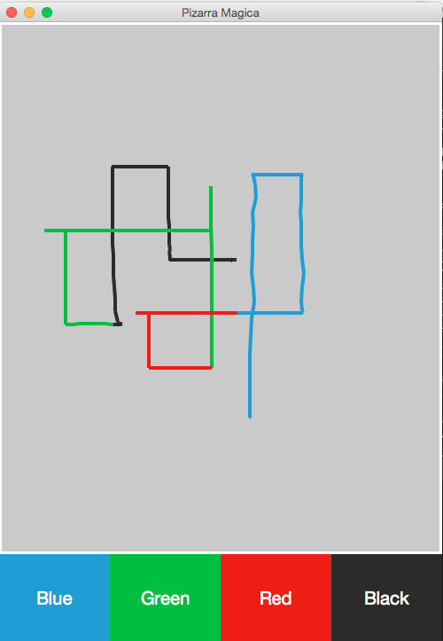
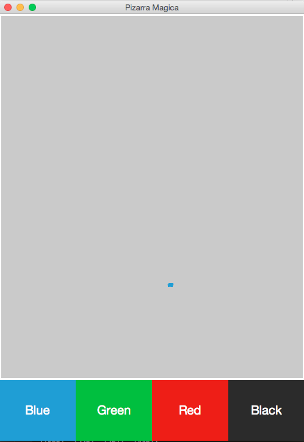
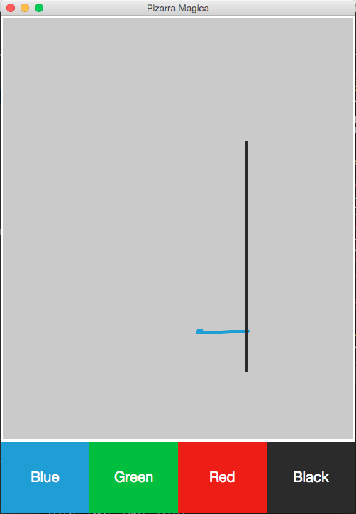
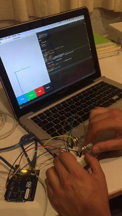

Bernardo Dominguez Pedroza - Examen 2 - Pizarra Magica
======

## Notas
* Para cumplir con el árbol de carpetas solicitado, se agregaron las carpetas **Models** y **Assets**, aunque no se necesitó recurrir a algún archivo en Assets ni se involucraban tratamientos de datos como para trasladarlos a Models, todo quedaba en el MainView, por eso las carpetas están vacías.
* No lo noté hasta que ya iba avanzado, pero al principio realicé varios commits con la palabra **Started**. Esto no significa que haya hecho un commit de algo a medias (lo que sería una mala práctica), lo que significaba para mí era que ya funcionaba de cierta forma, pero sabía que al final no quedaría así. Lo hice así porque necesitaba abstraerlo poco a poco, puede ser verificado.
* El color por defaul de la línea siempre es el negro.
* Se agregó un background gris a la pizarra para intentar hacerlo más verosímil a una pizarra mágica, ya que las pantallas no eran blancas completamente, si no mal recuerdo se encontraban un poco opacadas.
* Se trabajó como lo visto en clase. Comenzamos en el main, donde básicamente se maneja todo lo correspondiente a arduino y se inicia el mainview. Ya en el mainview se crea toda la ventana con los widgets, pero ojo, para crear los botones se recurre a un constructor en otra clase, en el archivo **ColorButton**. En ColorButton se crea cada botón y se maneja cada uno de sus clicks, esto es que cada click se regresa el color correspondiente al MainView. En MainView se aplica el color clickeado, y también aquí se maneja la instrucción de la barra espaciadora, limpiando el canvas.
* La verdad sí merece los 110 puntos. :+1:

## Capturas de funcionamiento

## Gif de funcionamiento
