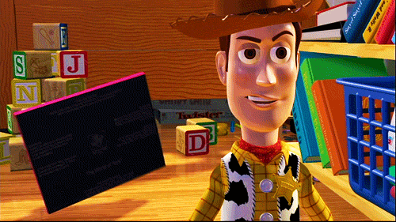
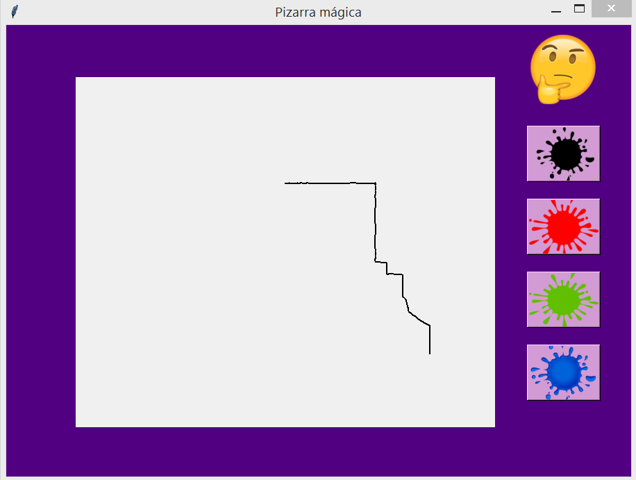
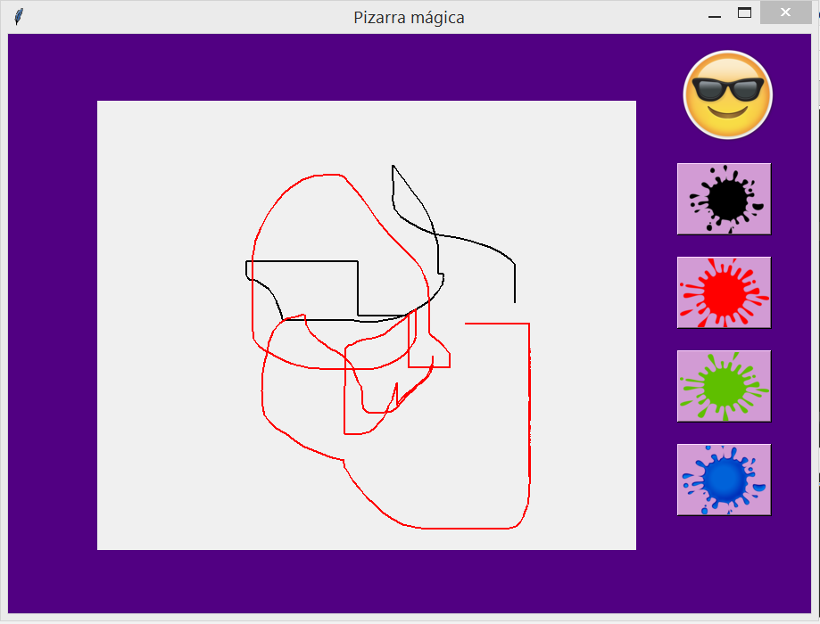
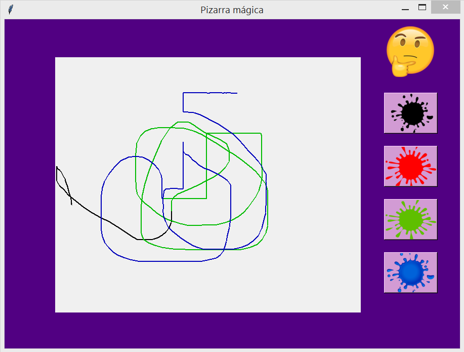
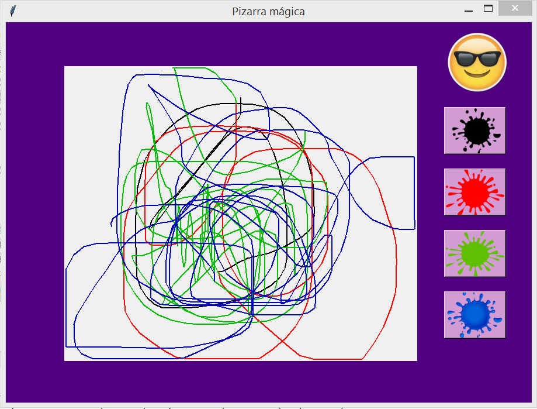
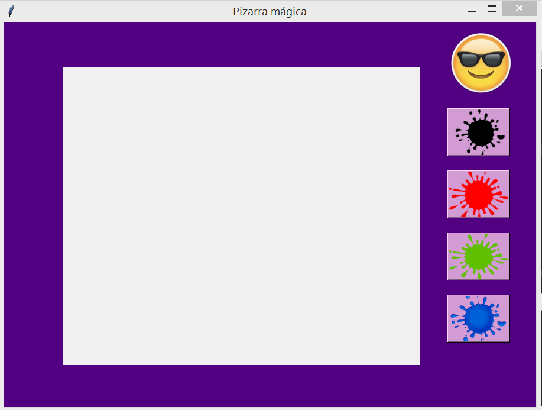

LAURA REYNOSA MONTOYA - Examen 2 - Pizarra Magica
======

## Nota
Se presenta una pizarra mágica que funciona mediante la comunicación serial con un arduino  y dos potenciómetros. Todo funciona correctamente.

## Camputas de funcionameinto
Al iniciar el programa:

Comenzando a dibujar (El emoji cambia cuando se esta dibujando):

Cambiando colores:

Cuando se limpia la pantalla la pantalla aparece al igual que en el inicio:

## Gif de fucnionamiento
Funcionamiento
