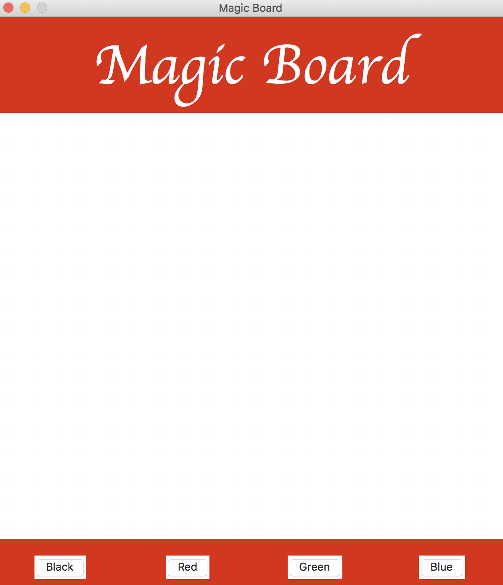
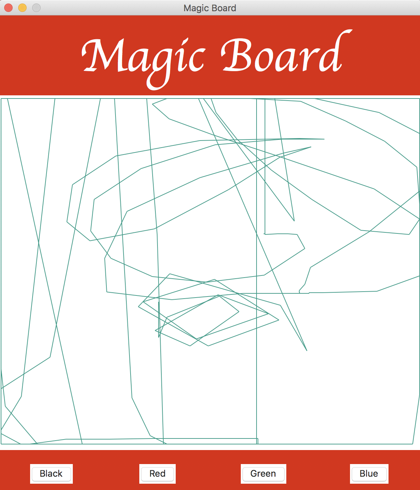
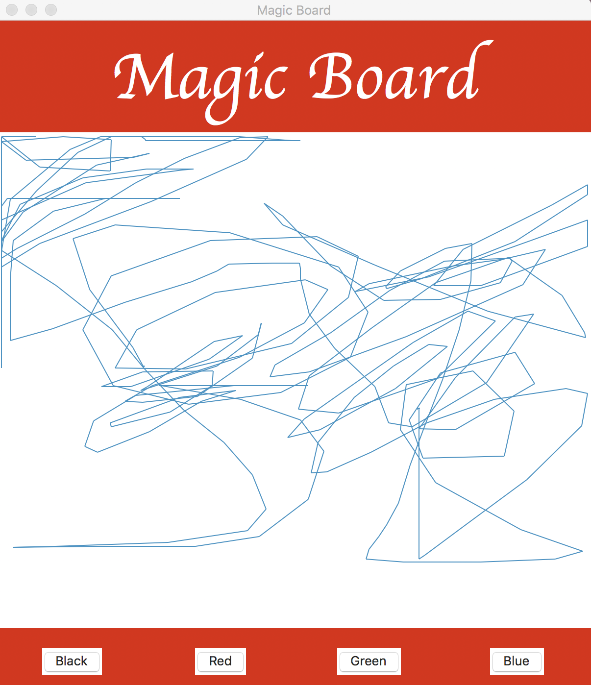
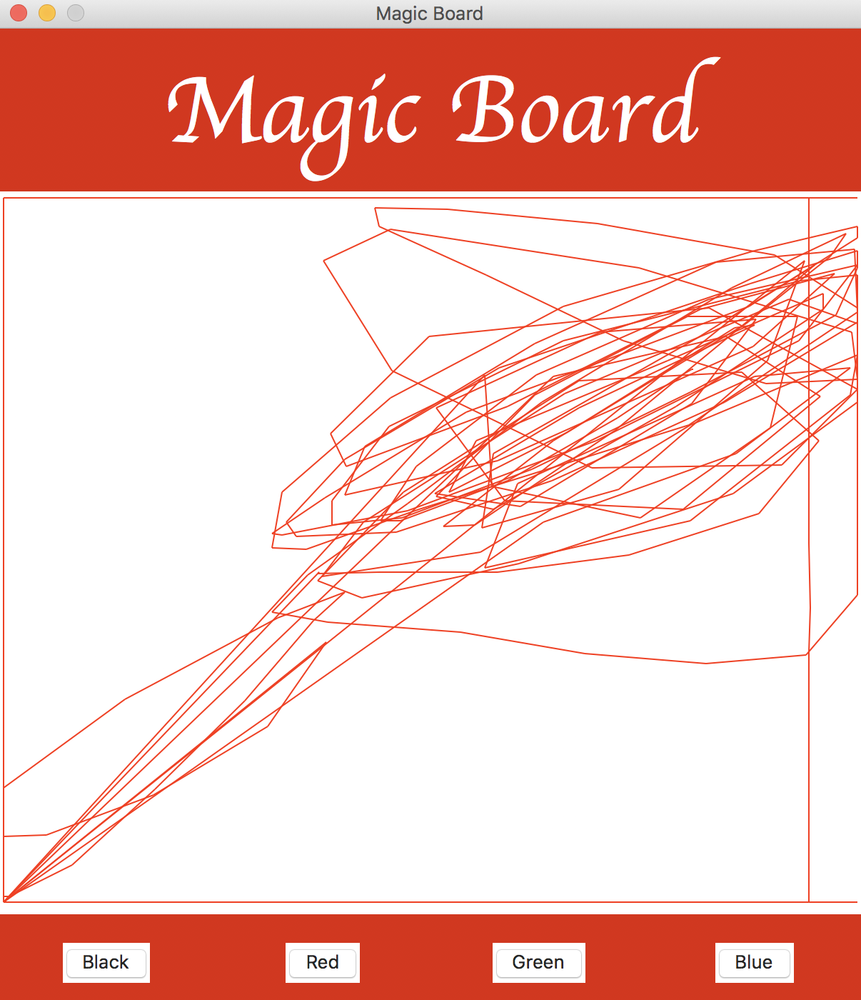
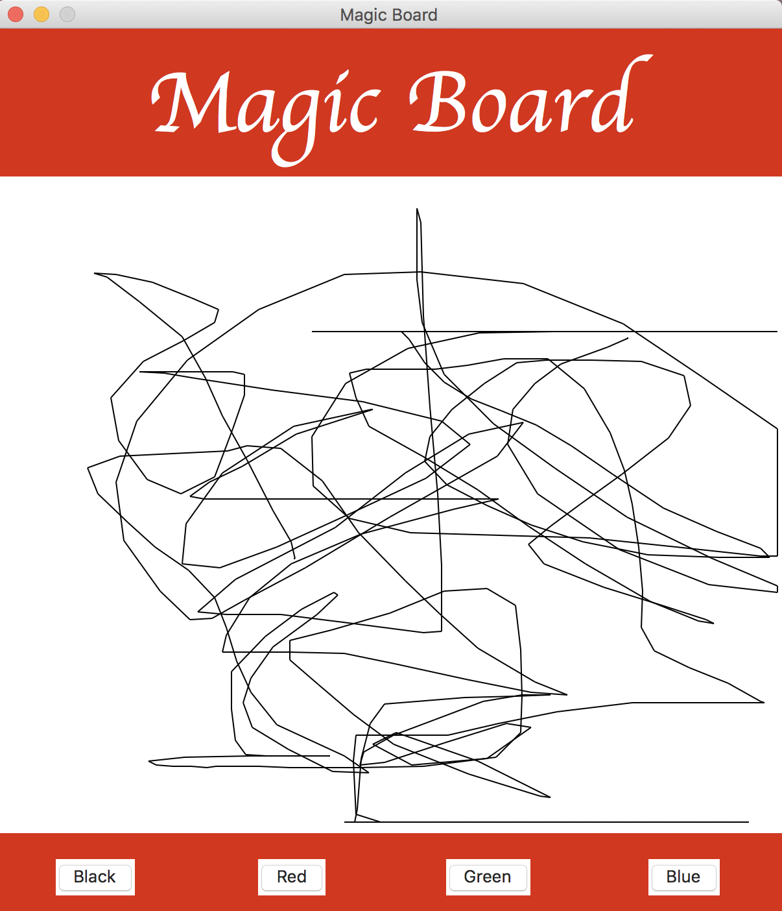
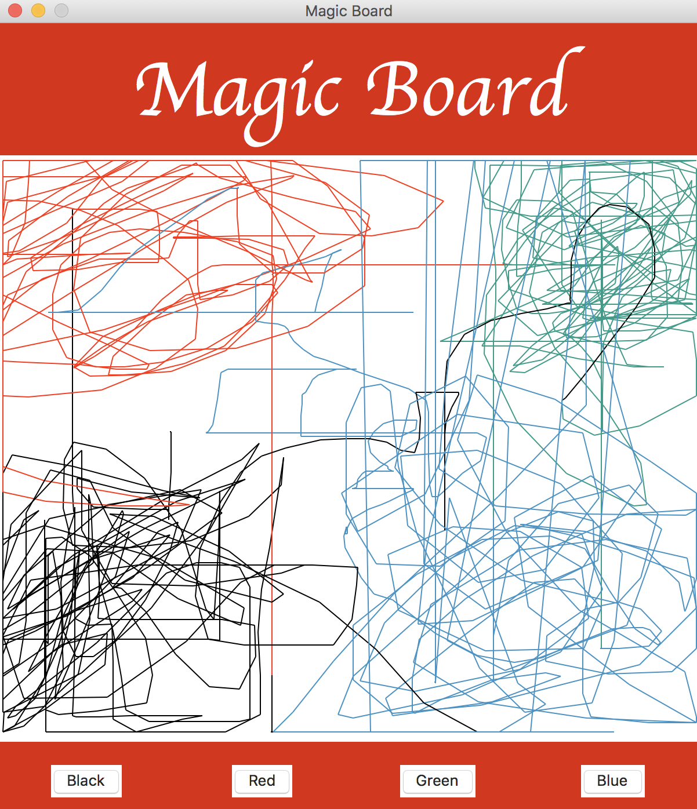

ORTEGA GARCIA AIDAN ALEJANDRO - Examen 2 - Pizarra Magica
======

## Nota
El archivo de arduino no va con rangos de 0-600 y de 0-500, se les hizo un ajuste ya que
el canvas parecía estar algo desfasado de la pantalla roja que se muestra como la parte plástica
del juguete.
De igual manera intenté implementar un cambio en los botones mediante background y activebackground,
no tuve exito.

Como nota de experiencia de este examen, aprendí muchísimo de mis faltas pasadas y auqnue me costó
realizar el examen, sí se pudo y de la manera que se pedía.

## Capturas de funcionamiento

## Gif de funcionamiento
