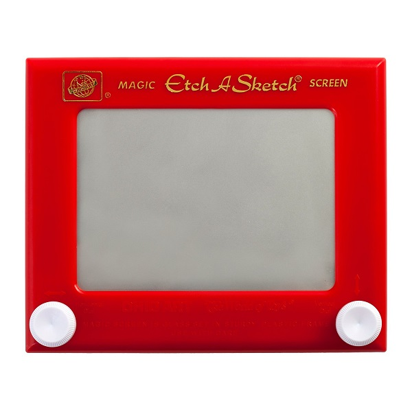

Examen 2 - Pizarra Magica
======



## Requerimientos
* La Aplicación debe de seguir la arquitectura MVC y utilizar los componentes de TKInter
* El usuario debe de pintar lineas sobre un lienzo (canvas) en blanco 
* El area efectiva de dibujo de 500 X 600 pixeles 
* El usuario puede mover el cursos de forma vertical con un potenciomentro
* El usuario puede mover el cursos de forma vertical con otro potenciomentro
* El usuario puede limpiar el lienzo al presionar la barra de espacio
* El usuario puede ver 4 botones en la interfaz botones
* Cada botón cambia el color del cursor (Negro, Rojo, Verge, Azul)

* Se realizara la entrega el domingo 29 de octubre de 23:00 a 23:20, no antes, no después, si se entrega fuera del horario, hay una penalización de 50 puntos
* A través de un PullRequest a este repositorio
* Se presentara de forma física el Lunes 30 de Octubre en el horario de clase 
* En el repositorio a entregar se debe de eliminar **ESTE README**, llenar el **README2** y colocarlo como el README principal
* Los archivos deben de seguir el siguiente árbol de carpetas

```
.
|____README.md
|____ReadmeAssets # Carpeta con assets para README
|____main.py # Controlador principal
|____Models # Carpeta con todos los modelos
|____Views # Carpeta con todas las vistas
|____Assets # Carpeta con todos los assets
```

## Evaluacion
|Topico| Descripcion| Puntaje |		
|---|---|---|
|Funcionamiento| El proyecto debe de cumplir con todos los requerimientos | 70% |		
|Buenas practicas en código| El proyecto debe de seguir con todas mas buenas practicas vistas a lo largo del curso | 20%|		
|Buenas practicas en repositorio| El proyecto debe de seguir las buenas practicas de manejo de commits vistas en clase|10%|		
|Estética*| Cada Interfaz debe de ser única, por lo que se puede dar hasta un punto extra si tiene una interfaz estetica unica |10%|

## Tips
Cosulta los diferentes tipos de eventos en: [http://effbot.org/tkinterbook/tkinter-events-and-bindings.htm](http://effbot.org/tkinterbook/tkinter-events-and-bindings.htm)		

