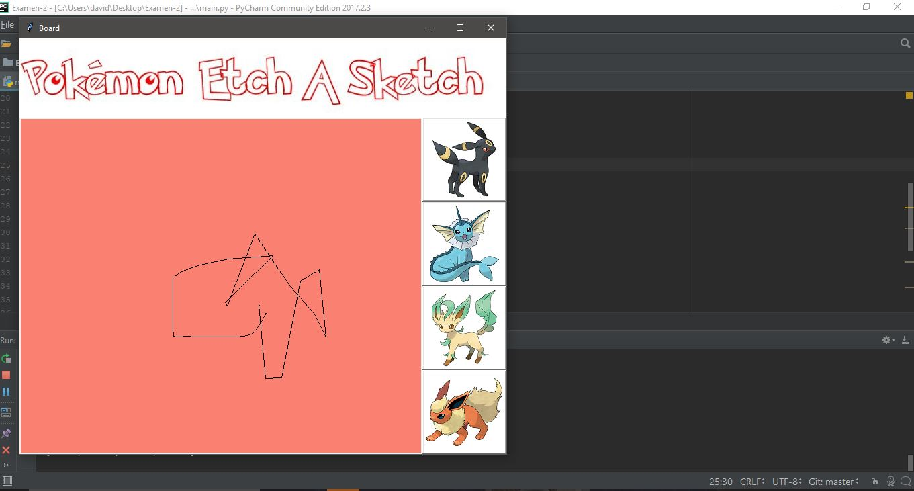
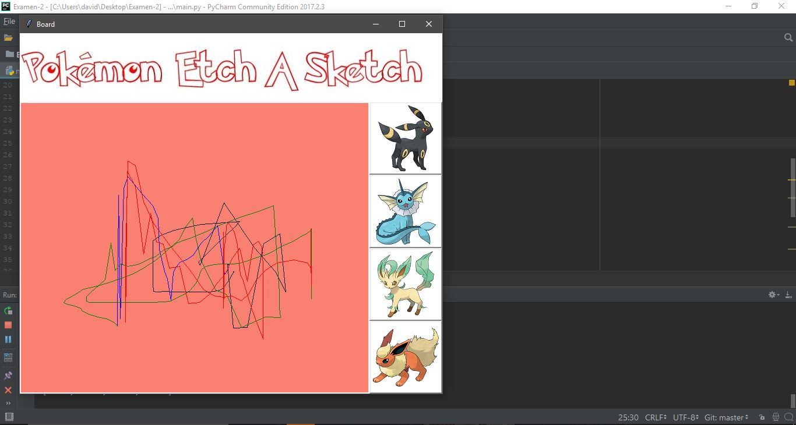

Zorrilla Gasca David Alfonso - Examen 2 - Pizarra Magica
======

## Nota
EL programa como tal no tiene algún secreto para su funcionamiento, traté de manternerlo lo mas sencillo que pude. Cabe mecionar que para que funcione, se debe tener conectado el arduino con sus respectivos potenciómetros adecuadamente.

## Capturas de funcionameinto

## Gif de fucnionamiento

