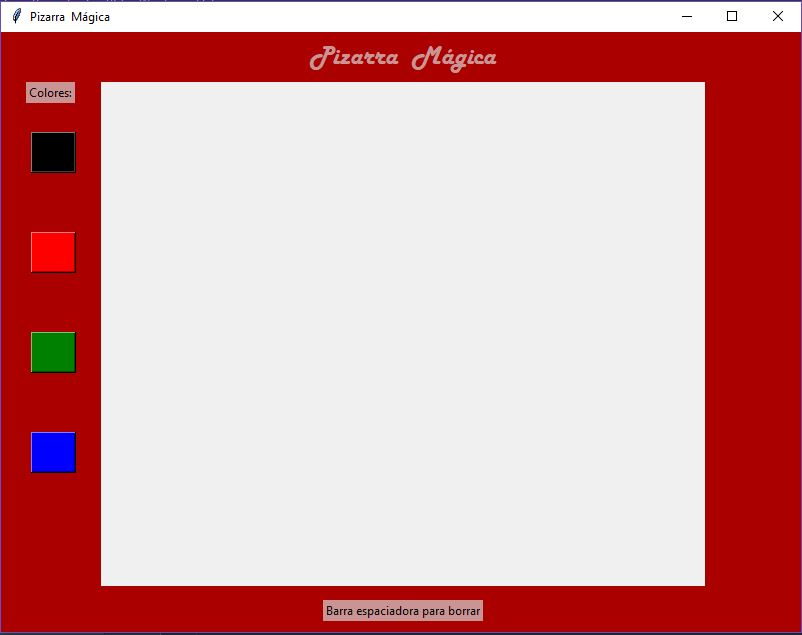

Hernández Castro Carlos Alexis - Examen 2 - Pizarra Magica
======

## Nota
El archivo main.py controla la creacion de la interfaz, dibujos y transferencia de datos.
El archivo MainView.py crea todo lo que un usuario puede ver.
En cuanto al menejo de los potenciometros, éstos deben manipularse despacio ya que moverlos rápido puede provocar
trazos incorrectos.

Por error subí una carpeta adicional con el archivo de arduino, pero no pude eliminarla.

## Capturas de funcionamiento

## Gif de funcionamiento

