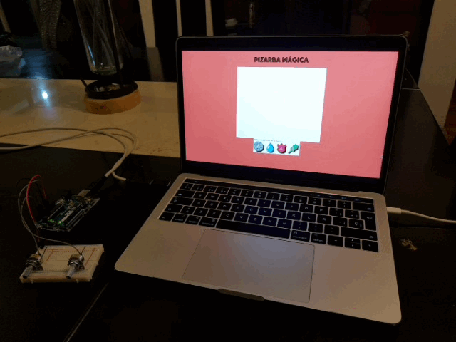

Mendoza Domínguez Manuel Alejandro - Examen 2 - Pizarra Magica
======

## Nota
Para el correcto funcionamiento se debe tener conectado un circuito de dos potenciometros
a una placa Arduino UNO. Los potenciometros deben estar alimentados por 5 Volts, conectados
al primer y al segundo puerto analógico de la placa.

## Capturas de funcionameinto
#### Movimiento Básico
* 
El cursor se mueve verticalmente con el potenciomentro izquierdo.

* 
El cursor se mueve horizontalmente con el potenciometro derecho.

#### Funcionamiento de la Barra Espaciadora

Al presionar la barra espaciadora, el lienzo donde esta el dibujo se borra. Esto 
nos permite realizar un nuevo dibujo.

#### Cambio de Color de la Linea

Presionando alguna de las cuatro medallas de gimnasio que se encuentran bajo el lienzo
se puede cambiar el color del cursor.

## Gif de fucnionamiento
